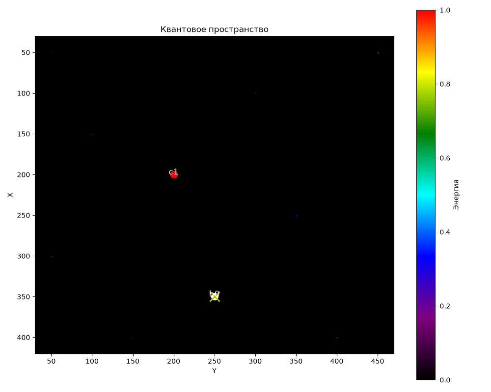
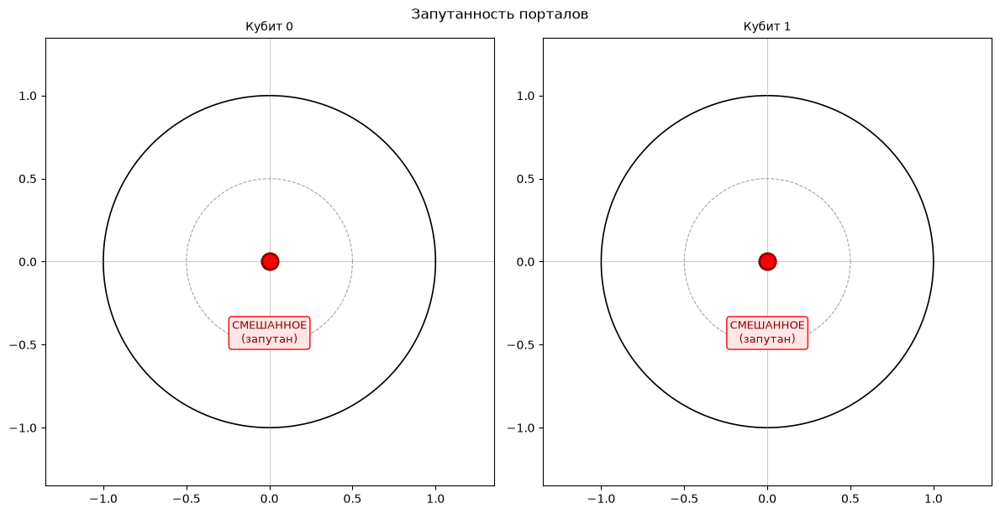
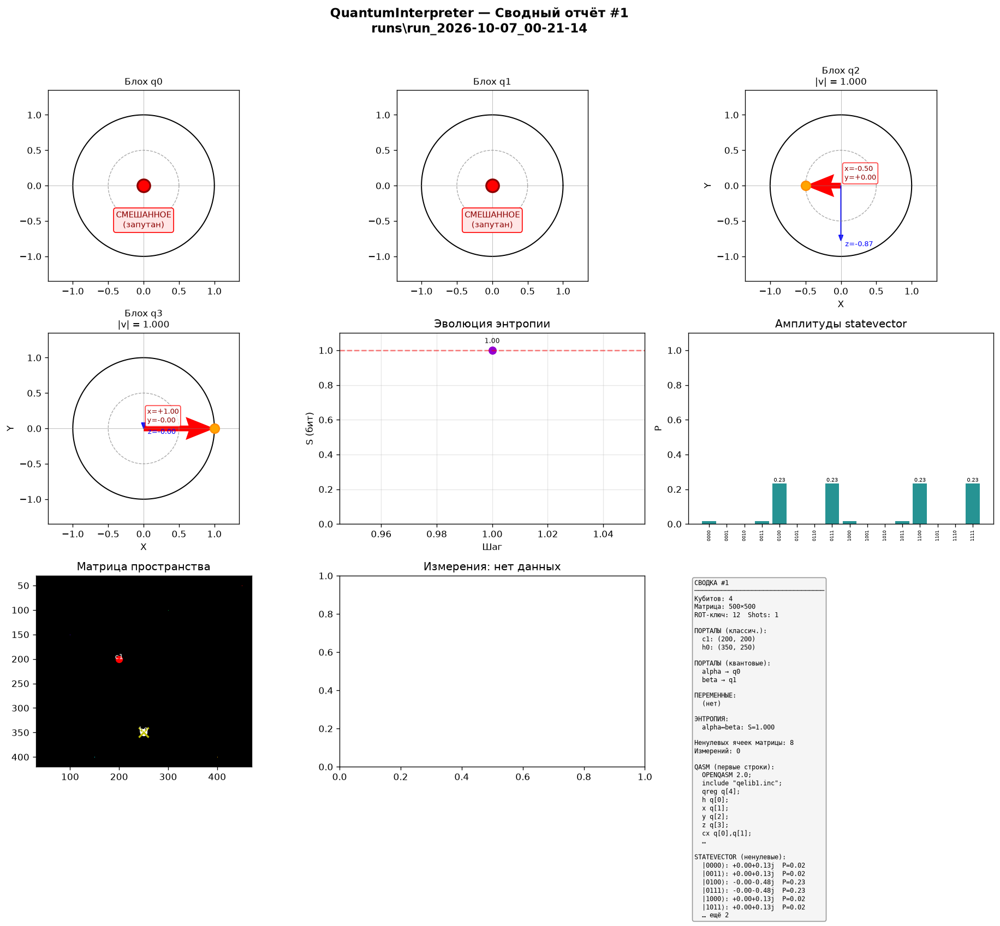

# QuantumInterpreter

**Гибридный классическо-квантовый интерпретатор** на Python + Qiskit.

Учебная песочница для экспериментов с квантовыми схемами через текстовый
DSL: суперпозиция, запутанность, измерения, сфера Блоха, энтропия фон
Неймана — плюс классический слой с порталами, матрицей пространства и
ROT-шифрованием. Три интерфейса: CLI/REPL, GUI (Tkinter), Web (Streamlit).
Каждый запуск сохраняется в отдельную папку `runs/run_<timestamp>/`.


---

## 📑 Содержание

- [Возможности](#-возможности)
- [Установка](#-установка)
- [Быстрый старт](#-быстрый-старт)
- [Интерфейсы](#-интерфейсы)
  - [CLI / REPL](#1-cli--repl)
  - [GUI (Tkinter)](#2-gui-tkinter)
  - [Web (Streamlit)](#3-web-streamlit)
- [Команды](#-команды)
  - [Переменные и конфиг](#переменные-и-конфиг)
  - [Классические](#классические)
  - [Квантовые](#квантовые)
  - [Файлы](#файлы)
  - [Специальные](#специальные)
- [Примеры](#-примеры)
- [Визуализация](#-визуализация)
- [Сводный PNG](#-сводный-png)
- [Структура папки запуска](#-структура-папки-запуска)
- [Как это работает](#-как-это-работает)
- [Структура проекта](#-структура-проекта)
- [Ограничения](#-ограничения)
- [Расширение](#-расширение)
- [Литература](#-литература)
- [Лицензия](#-лицензия)

---

## ✨ Возможности

### Классический слой
| Команда | Действие |
|---|---|
| `flp12"<text>"` / `flp12 "<text>"` | ROT-преобразование текста (ключ настраивается) |
| `^<:c1` / `^<:h0` / `set_portal <n>` | Активировать портал в позиции курсора |
| `?c1==1` | Проверить калибровку портала `c1` |
| `go ^, it` / `go` | Телепортация курсора к `h0`, запись 42 в матрицу |
| `devixs detected` / `devixs` | Обнулить матрицу пространства |
| `move <dx> <dy>` | Сдвинуть курсор |
| `set_cell <val>` | Записать значение в матрицу |

### Квантовый слой (Qiskit)
| Команда | Действие |
|---|---|
| `h <q>` | Гейт Адамара |
| `x` / `y` / `z <q>` | Pauli-гейты |
| `rx` / `ry` / `rz <q> <θ>` | Повороты на угол θ (радианы) |
| `cx <c> <t>` | CNOT |
| `cz <c> <t>` | CZ |
| `swap <a> <b>` | SWAP |
| `measure_qubit <q>` | Измерение кубита (коллапс) |
| `set_portal_q <name> <q>` | Привязать портал к кубиту |
| `entangle_portals <a> <b>` | H + CNOT → Белл-состояние |
| `bloch <q>` | Сохранить 2D-сферу Блоха (нумеруется) |
| `summary` | Сохранить сводный PNG 3×3 (нумеруется) |
| `print_state` | Вывести statevector |
| `qasm` | Вывести QASM схемы |

### Пользовательские переменные и конфигурация
- `set VAR value` — задать переменную (число или строка).
- `$VAR` — подстановка в любую команду.
- `config key value` — изменить параметр (`num_qubits`, `matrix_size`,
  `rot_key`, `cursor_start`, `shots`).
- `unset VAR`, `vars`, `config` — управление.

### Визуализация
- `qubit_<q>_bloch_N.png` — 2D-сфера Блоха со **стрелками XY и Z**,
  подписями компонент, модулем `|v|`. Для запутанных кубитов —
  **красная точка в центре** с пометкой «СМЕШАННОЕ (запутан)».
- `entanglement.png` — две сферы Блоха рядом (запутанная пара).
- `quantum_space.png` — матрица пространства с порталами и курсором.
- `measurements.png` — гистограмма измерений.
- `entropy.png` — столбчатая диаграмма энтропии запутанности.
- `entropy_evolution.png` — эволюция энтропии по шагам (точки + подписи).
- `amplitudes.png` — распределение вероятностей statevector.
- `summary_N.png` — **сводный PNG 3×3** (см. ниже).

### Файлы
- `save` / `save file.json` — сохранить состояние.
- `save_qasm` / `save_qasm file.qasm` — экспорт схемы в QASM.
- `save_report` / `save_report file.txt` — сохранить отчёт.
- `load file.json` — загрузить состояние.
- `new_run [prefix]` — создать новую папку запуска.

### Три интерфейса
- **CLI/REPL** — быстрые эксперименты в терминале.
- **GUI (Tkinter)** — поля параметров, кнопки, встроенные графики,
  панель «Описание процесса».
- **Web (Streamlit)** — слайдеры, графики, удобно для демонстраций.

---

## 🚀 Установка

Требуется **Python 3.10+**.

### Обязательные зависимости
```bash
pip install qiskit qiskit-aer numpy matplotlib requests
```

### Опциональные
```bash
# для GUI
pip install tkinter   # обычно входит в стандартную поставку Python

# для веб-интерфейса
pip install streamlit

# для экспорта схем в LaTeX (может потребоваться при визуализации)
pip install pylatexenc
```

### Проверка установки
```bash
python -c "import qiskit, qiskit_aer, numpy, matplotlib; print('OK')"
```

---

## ▶️ Быстрый старт

### Демо-скрипт (CLI)
```bash
python quantum_interpreter.py
```
Выполнит встроенный пример, сохранит все PNG и выведет отчёт.

### REPL
```bash
python quantum_interpreter.py --repl
```

### GUI
```bash
python quantum_interpreter.py --gui
# или
python gui.py
```

### Web (Streamlit)
```bash
streamlit run app_streamlit.py
```

---

## 🖥️ Интерфейсы

### 1. CLI / REPL

Запуск:
```bash
python quantum_interpreter.py --repl
```

Появится приглашение `q>`. Пример сессии:

```
q> set THETA 1.5708
  → $ THETA = 1.5708
q> set Q 0
  → $ Q = 0
q> h $Q
  → H → q0
q> ry 1 $THETA
  → RY(1.571) → q1
q> set_portal_q a 1
  → Портал 'a' → q1
q> set_portal_q b 2
  → Портал 'b' → q2
q> entangle_portals a b
  → Запутаны 'a' (q1) и 'b' (q2). Полная запутанность (S=1.000)
q> summary
  → Сводный график #1 → runs/run_.../summary_1.png
q> measure_qubit $Q
  → Измерение q0 → |1>
q> :viz
Все PNG сохранены в runs/run_... (кроме summary)
q> :report
...
q> :quit
```

### 2. GUI (Tkinter)

Запуск:
```bash
python gui.py
```

Возможности:
- **Панель параметров**: кубиты, размер матрицы, ROT-ключ, курсор,
  shots — поля ввода + кнопка «Применить».
- **Поле скрипта**: пишите команды, как в REPL. Есть **демо-скрипт** по
  умолчанию и кнопка **«Загрузить демо»**.
- **Быстрые команды**: 16 кнопок (H, X, Y, Z, RX, RY, RZ, CX, CZ, SWAP,
  Measure, Entangle, GHZ, Print, QASM, Сводка).
- **Кнопки**: «▶ Выполнить», «Визуализации», «Сводный график»,
  «Загрузить демо», «Очистить вывод», «Загрузить сост.», «Сохранить сост.».
- **Панель «Описание процесса»**: пошаговый разбор скрипта + итоговое
  состояние.
- **4 встроенных графика**: Блох, Энтропия, Амплитуды, Матрица.
- **Zoom +/−/Сброс**, экспорт графиков в PNG.
- **Светлая/тёмная тема**.
- **Сохранение/загрузка** скрипта и состояния (JSON).
- **Поиск по выводу** (Ctrl+F).

## Скриншоты





### 3. Web (Streamlit)

Запуск:
```bash
streamlit run app_streamlit.py
```

Возможности:
- **Боковая панель**: слайдеры для `num_qubits`, `matrix_size`, `rot_key`.
- **Текстовое поле** для скрипта.
- **Кнопки**: «▶ Выполнить», «Визуализации», «Сводный график».
- **Все `summary_*.png`** отображаются в вебе.
- **3 графика** в ряд: Блох, энтропия, амплитуды.
- **Развёрнутый отчёт** в аккордеоне.

---

## 📚 Команды

### Переменные и конфиг

| Команда | Действие |
|---|---|
| `set VAR value` | Задать переменную (число или строка) |
| `unset VAR` | Удалить переменную |
| `vars` | Показать все переменные |
| `config` | Показать текущую конфигурацию |
| `config key value` | Изменить параметр |

**Поддерживаемые ключи конфига:**

| Ключ | Тип | По умолчанию | Описание |
|---|---|---|---|
| `num_qubits` | int | 4 | Число кубитов |
| `matrix_size` | int | 1000 | Размер матрицы пространства |
| `rot_key` | int | 12 | Ключ ROT-преобразования |
| `cursor_start` | tuple | (6, 36) | Начальная позиция курсора |
| `shots` | int | 1 | Число выстрелов при измерении |
| `default_entropy_threshold_full` | float | 0.99 | Порог полной запутанности |
| `default_entropy_threshold_partial` | float | 0.01 | Порог частичной запутанности |

**Пример использования переменных:**
```
set THETA 1.5708
set Q 0
h $Q
ry 1 $THETA
measure_qubit $Q
```

**Пример изменения конфига:**
```
config num_qubits 6
config rot_key 5
config matrix_size 2000
config cursor_start 10,10
```

### Классические

| Команда | Действие |
|---|---|
| `flp12"<text>"` / `flp12 "<text>"` | ROT-преобразование текста |
| `^<:c1` / `^<:h0` / `set_portal <n>` | Активировать портал |
| `?c1==1` | Проверить калибровку `c1` |
| `go ^, it` / `go` | Телепортация к `h0`, запись 42 в матрицу |
| `devixs detected` / `devixs` | Обнулить матрицу |
| `move <dx> <dy>` | Сдвинуть курсор |
| `set_cell <val>` | Записать значение в матрицу |

### Квантовые

| Команда | Действие |
|---|---|
| `h <q>` | H-гейт |
| `x` / `y` / `z <q>` | Pauli-гейты |
| `rx` / `ry` / `rz <q> <θ>` | Повороты |
| `cx` / `cz` / `swap <a> <b>` | Двухкубитные гейты |
| `measure_qubit <q>` | Измерение кубита |
| `set_portal_q <name> <q>` | Портал → кубит |
| `entangle_portals <a> <b>` | H + CNOT между порталами |
| `bloch <q>` | Сфера Блоха (нумеруется) |
| `summary` | Сводный PNG 3×3 (нумеруется) |
| `print_state` | Вывести statevector |
| `qasm` | Вывести QASM схемы |

### Файлы

| Команда | Действие |
|---|---|
| `save` / `save <file.json>` | Сохранить состояние (по умолчанию в папку запуска) |
| `load <file.json>` | Загрузить состояние |
| `save_qasm` / `save_qasm <file.qasm>` | Экспорт схемы в QASM |
| `save_report` / `save_report <file.txt>` | Сохранить отчёт |
| `new_run [prefix]` | Создать новую папку `runs/<prefix>_<timestamp>/` |

### Специальные (REPL)

| Команда | Действие |
|---|---|
| `help` | Показать справку |
| `:report` | Полный отчёт о состоянии |
| `:viz` | Построить все визуализации (кроме summary) |
| `:new_run` | Создать новую папку запуска |
| `:quit` / `:exit` | Выход |

---

## 🧪 Примеры

### 1. Суперпозиция и измерение
```
h 0
measure_qubit 0
print_state
```
После H кубит 0 в `(|0>+|1>)/√2`. Измерение даёт 0 или 1 с вероятностью 50/50.

### 2. Белл-состояние (максимальная запутанность)
```
set_portal_q a 1
set_portal_q b 2
entangle_portals a b
print_state
summary
```
Statevector: `(|00> + |11>)/√2` для кубитов 1 и 2. Энтропия S = 1.000 бит.
Сводный PNG покажет точку в центре сферы Блоха для q1, q2.

### 3. GHZ-состояние (3 кубита)
```
h 0
cx 0 1
cx 1 2
print_state
summary
```
Statevector: `(|000> + |111>)/√2`.

### 4. Поворот и измерение
```
set THETA 1.5708     # π/2
ry 0 $THETA
measure_qubit 0
```

### 5. Классический сценарий
```
^<:c1 flp12"hello world" ?c1==1
go ^, it
devixs detected
```

### 6. Полный гибридный сценарий (демо-скрипт)
```
# ---- Конфигурация ----
config num_qubits 4
config matrix_size 500

# ---- Матрица: 8 точек ----
config cursor_start 50,50
move 0 0
set_cell 5
config cursor_start 150,100
move 0 0
set_cell 10
config cursor_start 300,50
move 0 0
set_cell 15
config cursor_start 400,150
move 0 0
set_cell 20
config cursor_start 100,300
move 0 0
set_cell 25
config cursor_start 250,350
move 0 0
set_cell 30
config cursor_start 400,400
move 0 0
set_cell 35
config cursor_start 50,450
move 0 0
set_cell 40

# ---- Порталы ----
config cursor_start 200,200
move 0 0
set_portal c1
config cursor_start 350,250
move 0 0
set_portal h0

# ---- ROT-текст ----
flp12 "quantum demonstration"

# ---- 4 разных вектора Блоха ----
h 0
x 1
y 2
z 3

bloch 0
bloch 1
bloch 2
bloch 3

# ---- Повороты ----
ry 0 0.7854
ry 1 1.0472
ry 2 0.5236
ry 3 1.5708

bloch 0
bloch 1
bloch 2
bloch 3

# ---- Запутанность ----
set_portal_q alpha 0
set_portal_q beta 1
entangle_portals alpha beta

bloch 0
bloch 1
bloch 2
bloch 3

# ---- СВОДКА №1 (до измерений) ----
summary

# ---- Измерения ----
measure_qubit 0
measure_qubit 1
measure_qubit 2
measure_qubit 3

# ---- Финальный вывод ----
print_state
qasm
```

---

## 🎨 Визуализация

После запуска скрипта или команды `:viz` сохраняются PNG-файлы:

| Файл | Что показывает |
|---|---|
| `qubit_<q>_bloch_N.png` | 2D-проекция сферы Блоха (стрелки XY и Z, модуль \|v\|) |
| `entanglement.png` | Две сферы Блоха рядом для запутанных кубитов |
| `quantum_space.png` | Матрица пространства с порталами и курсором |
| `measurements.png` | Гистограмма измерений по кубитам |
| `entropy.png` | Столбчатая диаграмма энтропии запутанности |
| `entropy_evolution.png` | Эволюция энтропии по шагам (точки + подписи) |
| `amplitudes.png` | Распределение вероятностей statevector |
| `summary_N.png` | **Сводный PNG 3×3** (см. ниже) |

**В GUI** эти же графики встроены прямо в окно (4 панели + сводка).
**В Streamlit** — три графика в ряд + все `summary_*.png`.

---

## 📊 Сводный PNG

Команда `summary` создаёт **один PNG 3×3** со всеми ключевыми
визуализациями. Файл **нумеруется** — `summary_1.png`, `summary_2.png`, … —
поэтому можно снимать сводку **несколько раз** в одном запуске и
сравнивать «до/после».

Сетка 3×3:

```
┌──────────────┬──────────────┬──────────────┐
│ 1. Блох q0   │ 2. Блох q1   │ 3. Блох q2   │
├──────────────┼──────────────┼──────────────┤
│ 4. Блох q3   │ 5. Эволюция  │ 6. Амплитуды │
│              │   энтропии   │              │
├──────────────┼──────────────┼──────────────┤
│ 7. Матрица   │ 8. Измерения │ 9. Сводка:   │
│              │              │ порталы, QASM│
│              │              │ statevector  │
└──────────────┴──────────────┴──────────────┘
```

**Панель 9** содержит:
- список классических порталов с координатами,
- список квантовых порталов (`name → qN`),
- список переменных,
- энтропию запутанности,
- число ненулевых ячеек матрицы,
- число измерений,
- **первые 8 строк QASM**,
- **ненулевые амплитуды statevector** с вероятностями.

**Для смешанных состояний** (запутанных кубитов) вместо стрелки Блоха
рисуется красная точка в центре с подписью «СМЕШАННОЕ (запутан)».

---

## 📂 Структура папки запуска

Каждый вызов `execute()` создаёт отдельную папку:

```
runs/
└── run_2026-10-07_00-09-57/
    ├── qubit_0_bloch_1.png
    ├── qubit_0_bloch_2.png
    ├── qubit_0_bloch_3.png
    ├── qubit_1_bloch_1.png
    ├── ...
    ├── qubit_3_bloch_3.png
    ├── entanglement.png
    ├── summary_1.png
    ├── summary_2.png
    ├── quantum_space.png
    ├── measurements.png
    ├── entropy.png
    ├── entropy_evolution.png
    ├── amplitudes.png
    ├── state.json
    ├── circuit.qasm
    └── report.txt
```

**Команда `new_run [prefix]`** создаёт **новую** папку внутри `runs/`,
сбрасывает счётчики `bloch_counter` и `summary_counter` и перенаправляет
последующие PNG/JSON/QASM туда.

---

## 🔬 Как это работает

### Квантовая часть
- Схема хранится в `QuantumCircuit(num_qubits, name="main")`.
- Для получения состояния используется `AerSimulator(method="statevector")`.
- Измерения — через `AerSimulator` с `shots=1, memory=True`, затем коллапс:
  `reset(q)` + `x(q)` при бите 1.
- Энтропия фон Неймана: `partial_trace(state, other_qubits)` + `entropy(rho, base=2)`.
- Координаты Блоха: `expectation_value(SparsePauliOp("X"/"Y"/"Z"))` на
  редуцированной матрице плотности.

### Классическая часть
- Матрица `matrix_size × matrix_size` — «пространство состояний».
- Портал — точка `(x, y)` в матрице.
- ROT-преобразование — сдвиг Unicode-кода каждого символа на `rot_key`.

### Переменные
- `$VAR` заменяются через `re.sub(r"\$(\w+)|\$\{(\w+)\}", ...)` перед парсингом.
- Значения автоматически парсятся как `int`, `float` или `str`.

### Конфиг
- Хранится в `@dataclass Config`.
- Изменения через `config key value` применяются на лету.
- Смена `num_qubits` пересоздаёт квантовую схему.
- Смена `matrix_size` пересоздаёт матрицу.
- Смена `cursor_start` **реально** перемещает курсор в новую позицию.

### Совместимость с Qiskit 1.x
- Метод `QuantumCircuit.qasm()` **удалён** в Qiskit 1.0.
- Используется `qiskit.qasm2.dumps(circuit)` через обёртку
  `_circuit_to_qasm(circuit)` с fallback на `circuit.qasm()` для старых
  версий.

---

## 📂 Структура проекта

```
.
├── quantum_interpreter.py     # ядро + CLI/REPL + демо
├── gui.py                     # GUI на Tkinter
├── app_streamlit.py           # веб-интерфейс на Streamlit
├── README.md                  # этот файл
├── LICENSE                    # MIT
├── requirements.txt           # зависимости
├── .gitignore                 # игнорируем runs/, .venv/ и т.д.
└── runs/                      # автогенерируемая папка
    └── run_<timestamp>/
        └── ...                # PNG, JSON, QASM, отчёт
```

> ⚠️ Папка `runs/` **не должна попадать в Git**. Убедитесь, что
> `.gitignore` содержит `runs/`, `*.png`, `*.json`, `*.qasm`.

---

## ⚠️ Ограничения

- **Локальная симуляция** через `AerSimulator`, без реального квантового железа.
- **`connect_to_quantum_web()`** — заглушка: домен `api.quantumnetwork.io`
  не существует, всегда возвращает ошибку подключения.
- **Память**: statevector растёт как `2^n`. При `num_qubits ≥ 20`
  потребуется много RAM (несколько ГБ).
- **Нет шумов и декогеренции** — только идеальный симулятор.
- **Ограниченный набор гейтов**: нет `ccx`, `cswap`, `rxx`, `ryy`, `rzz`.
- **GUI на Tkinter** не поддерживает 3D-графику (только 2D-проекции Блоха).
- **После `measure_qubit`** statevector коллапсирует — график амплитуд
  становится 1-столбиковым. Снимайте `summary` **до** измерений, если
  нужна «богатая» картина.

---

## 🛠️ Расширение

### Добавить новый гейт

В `execute_line()` добавьте ветку:

```python
elif cmd == "ccx":
    self.circuit.ccx(int(args[0]), int(args[1]), int(args[2]))
    self.output.append(f"Toffoli q{args[0]} q{args[1]} → q{args[2]}")
```

### Добавить новый параметр конфига

В `Config`:

```python
new_param: float = 3.14
```

И в `set_config()` ничего менять не нужно — парсинг автоматический.

### Подключение к IBM Quantum

Замените `AerSimulator` на `QiskitRuntimeService`:

```python
from qiskit_ibm_runtime import QiskitRuntimeService, SamplerV2
service = QiskitRuntimeService(channel="ibm_quantum", token="...")
backend = service.least_busy(operational=True, simulator=False)
```

### Экспорт отчёта в PDF

```python
from matplotlib.backends.backend_pdf import PdfPages

def export_pdf(self, path: str) -> None:
    with PdfPages(path) as pdf:
        # добавляйте фигуры через pdf.savefig(fig)
        ...
```

### Интерактивный 3D-Блох

```python
fig = plt.figure()
ax = fig.add_subplot(111, projection="3d")
ax.quiver(0, 0, 0, x, y, z, color="red")
```

### Многократные запутанные пары

```
set_portal_q a1 0
set_portal_q b1 1
entangle_portals a1 b1

set_portal_q a2 2
set_portal_q b2 3
entangle_portals a2 b2
```

Тогда `entropy_evolution.png` покажет **две** точки, а `summary_N.png` —
две запутанные пары (4 красные точки в центре).

---

## 📚 Литература

- Nielsen M., Chuang I. *Quantum Computation and Quantum Information*.
  Cambridge University Press, 2010.
- Qiskit Textbook: <https://qiskit.org/learn>
- Документация Qiskit: <https://docs.quantum.ibm.com>
- OpenQASM 3.0 Specification: <https://openqasm.com>

---

## 📜 Лицензия

MIT License. Используйте свободно в учебных, исследовательских и
коммерческих целях.

---

## 🙏 Благодарности

Проект вдохновлён идеей «квантового ассемблера» и учебными DSL
для квантовых вычислений: **Q#** (Microsoft), **Silq** (ETH Zurich),
**OpenQASM** (IBM).

---

**Приятных экспериментов! 🧪⚛️**
